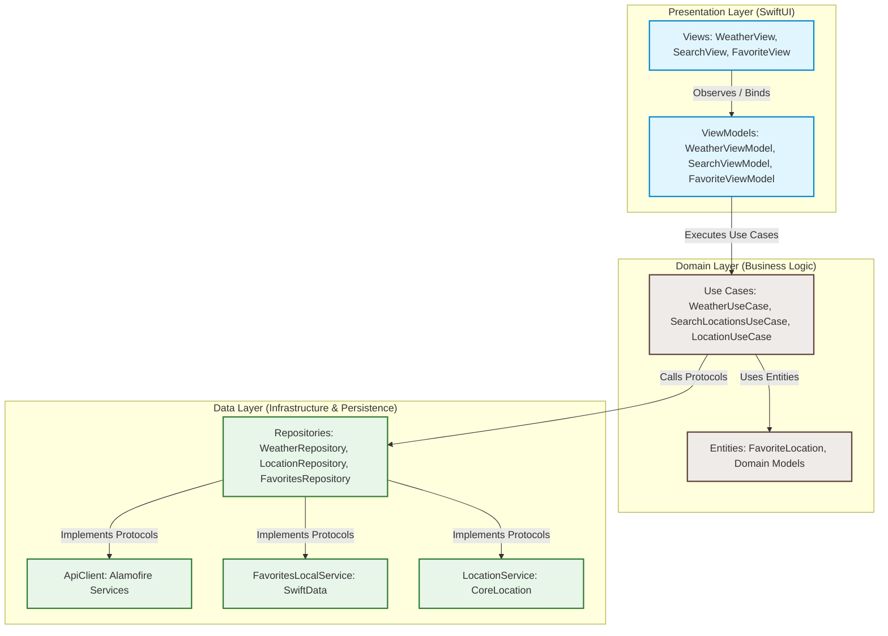
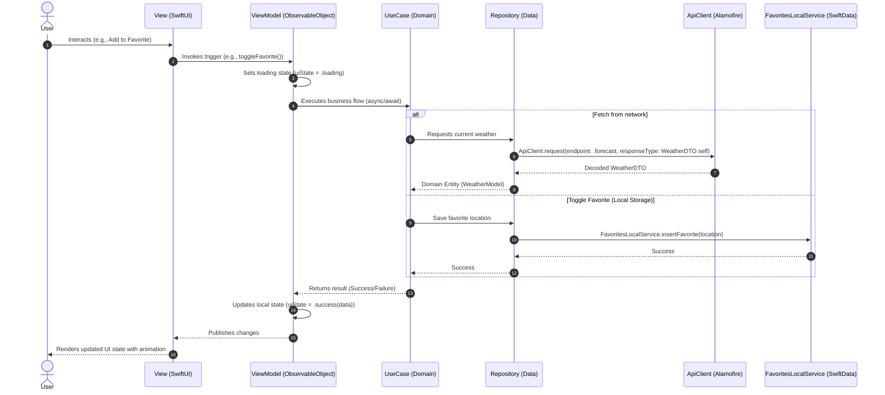

# 🌌 SkyGlass

[](https://developer.apple.com/ios/)
[](https://developer.apple.com/swift/)
[](https://developer.apple.com/videos/play/wwdc2022/10056/)
[](https://github.com/Alamofire/Alamofire)
[](https://github.com/features/actions)
[](https://opensource.org/licenses/MIT)

> A production-grade weather forecasting and location management application built using SwiftUI, SwiftData, and Alamofire, adhering to Clean Architecture principles.

---

## 📖 Overview

**SkyGlass** is a modern iOS application designed to provide users with hyper-local, real-time weather forecasting and location tracking. Engineered as a high-performance showcase of modern iOS development, SkyGlass bridges the gap between sleek, responsive UI interactions and highly structured, testable architectures.

### Business Purpose
To empower travelers, commuters, and weather-sensitive professionals with an intuitive interface to search, monitor, and save their favorite locations worldwide, ensuring they receive instant weather forecasts even under varying network conditions.

### Main Value Proposition
*   **Offline-First Experience:** Leverages **SwiftData** to cache favorite locations and recent search logs.
*   **Modern Networking Layer:** Robust, type-safe API consumption using **Alamofire** wrapped in Swift Concurrency (`async/await`).
*   **Clean Design Language:** A unified theme engine with fluid layout animations matching Apple's native Human Interface Guidelines (HIG).

---

## ✨ Features

### 👤 User-Facing Capabilities
*   🔍 **Interactive Location Search:** Fast, auto-completing search for cities worldwide using the WeatherAPI search endpoint.
*   🌤️ **Comprehensive Forecast Details:** Current weather conditions, hourly temperatures, and multi-day forecasts.
*   📌 **Favorite Locations Management:** Tap to bookmark favorite cities, instantly viewable on a clean favorites dashboard.
*   📍 **CoreLocation Integration:** Automatic weather retrieval for the user’s current GPS coordinates on startup.
*   🎨 **Fluid User Interface:** Beautiful animations, custom pull-to-refresh behavior, and custom-tailored weather icons.

### 🛠️ Technical Highlights
*   **Dependency Injection (DI):** Managed dependency lookup using `AppContainer` to avoid rigid singletons and enable seamless mock testing.
*   **Configuration Security:** Decoupled base URLs and API Keys using Xcode Configuration (`.xcconfig`) files to prevent leak of sensitive secrets.
*   **CI/CD Pipeline:** Fully configured GitHub Actions pipeline orchestrating simulator builds using Fastlane.
*   **Decoupled Architecture:** Strict boundaries between Presentation, Domain, and Data layers.

---

## 📸 Screenshots

| Splash Screen | Location Search | Forecast View | Favorites Board |
| :---: | :---: | :---: | :---: |
|  <!-- TODO: Replace with real screenshots --> |  <!-- TODO: Replace with real screenshots --> |  <!-- TODO: Replace with real screenshots --> |  <!-- TODO: Replace with real screenshots --> |

---

## 🎥 Demo

### App Walkthrough
<!-- TODO: Add a high-quality GIF showing the core app flows -->


### Demo Video
> [!NOTE]
> For a detailed walkthrough of the UI features, check out our [Demo Video on YouTube/Loom](https://example.com/skyglass-demo) <!-- TODO: Replace with real video link -->.

---

## 🛠️ Tech Stack

| Technology | Purpose | Implementation Details |
| :--- | :--- | :--- |
| **Swift 6.0 / 5.10** | Core Language | Structs, Protocols, Swift Concurrency, Actor isolation |
| **SwiftUI** | UI Framework | Declarative UI, state-driven rendering, transitions |
| **SwiftData** | Local Storage | Persistence of `FavoriteLocation` entities, sorting descriptor |
| **Alamofire** | Networking | Async networking client, API interceptor, error decoding |
| **CoreLocation** | Geolocation | Fetching current location coordinates under privacy guidelines |
| **Fastlane** | Automation | CLI-driven lane automation for builds, tests, and screenshots |
| **GitHub Actions** | CI/CD | Pipeline execution on push to `main` branch on macOS virtual machines |

---

## 📐 Architecture

SkyGlass is built on **Clean Architecture** combined with **MVVM (Model-View-ViewModel)**. This boundary structure keeps the codebase highly maintainable, testable, and adaptable.



### Layer Responsibilities

1.  **Presentation Layer (SwiftUI + VM):**
    *   **Views:** Pure visual layout. Observes state changes in ViewModels using `@StateObject` / `@ObservedObject` or SwiftUI Observable framework.
    *   **ViewModels:** MainActor-isolated logic coordinators. Emits UI states, schedules tasks, and handles user interactions.
2.  **Domain Layer (Pure Swift):**
    *   **Use Cases:** Encapsulates a single business rules workflow (e.g. `SearchLocationsUseCase`). Highly reusable across different modules.
    *   **Entities:** Pure business models. Absolutely no dependency on databases or external frameworks.
3.  **Data Layer (Repositories & Adapters):**
    *   **Repositories:** Orchestrates networking, local caches, and location coordinates mapping them to domain models.
    *   **Services / Data Sources:** Network calls via `ApiClient` (Alamofire), SQLite mapping via SwiftData, or location requests via `CoreLocation`.

> [!TIP]
> **Why this architecture?** 
> By decoupling the layers, we can mock the entire network data and CoreLocation inputs inside `SkyGlassTests` without running a real simulator or making real network requests.

---

## 📂 Project Structure

The project has been structured into logical modules to maintain decoupling:

```text
SkyGlass/
├── App/                            # Application entry point and main orchestrator
│   ├── SkyGlassApp.swift           # Main App file setting up ModelContainer
│   ├── RootView.swift              # Coordinates tab layouts (Search, Weather, Favorites)
│   └── RootViewModel.swift         # Global navigation/state management
├── Config/                         # Build environments (.xcconfig files)
├── Core/                           # Shared infrastructure and platform engines
│   ├── DI/                         # Dependency Injection via AppContainer
│   ├── Network/                    # Alamofire API Client, Interceptors, and Errors
│   ├── Services/                   # Framework adapters (SwiftData, Location, WeatherServices)
│   ├── Repos/                      # Repositories mediating Domain and Data sources
│   ├── Models/                     # Core system models (e.g., FavoriteLocation)
│   ├── Routing/                    # Navigation and routing utilities
│   ├── Extensions/                 # Utility extensions (Foundation/SwiftUI)
│   └── Helpers/                    # Shared helper functions
├── Modules/                        # Modular feature sets
│   ├── Weather/                    # Weather feature containing Domain/Presentation layers
│   ├── Search/                     # Location Search domain/views
│   ├── Favorite/                   # Favorites display UI and state mapping
│   └── Splash/                     # Initial launch screen sequences
├── Theme/                          # Design tokens, Custom Colors, Typography
├── Views/                          # App-wide reusable SwiftUI components
└── Resources/                      # Media assets, localized strings, and configurations
```

---

## 🔄 Data Flow

The sequence diagram below visualizes a typical user flow (fetching weather for a selected location and saving it to favorites):



---

## 📥 Installation

### Prerequisites
*   **Xcode:** 16.4+ (Builds fail on earlier versions due to Swift 6 concurrency models)
*   **macOS:** macOS Sequoia (14.0+)
*   **Swift Version:** 5.10 / 6.0
*   **Deployment Target:** iOS 17.0+ (Required for SwiftData framework support)

---

## 🚀 Getting Started

1.  **Clone the Repository:**
    ```bash
    git clone https://github.com/[TODO_GITHUB_USER]/SkyGlass.git
    cd SkyGlass
    ```

2.  **Generate Configuration:**
    Ensure you create a local `.xcconfig` file for your weather credentials:
    ```bash
    cp Config/SkyGlass-Local.xcconfig.example Config/SkyGlass-Local.xcconfig
    ```

3.  **Insert API Key:**
    Open `Config/SkyGlass-Local.xcconfig` in your editor and input your WeatherAPI key:
    ```ini
    API_KEY = YOUR_ACTUAL_API_KEY_HERE
    ```

4.  **Open in Xcode:**
    ```bash
    open SkyGlass.xcodeproj
    ```

5.  **Build & Run:**
    *   Select your target simulator (iOS 17.0 or newer).
    *   Press `CMD + R` to build and run the app.

---

## ⚙️ Configuration

### Secret Management best practices
SkyGlass strictly avoids committing API keys to the repository. The application uses a multi-tier build configuration system:

*   **`Config/SkyGlass.xcconfig`**: Houses default parameters (such as `BASE_URL`). This configuration file is safely committed.
*   **`Config/SkyGlass-Local.xcconfig`**: Contains sensitive API keys and overrides. This file is ignored by `.gitignore`.
*   **`Info.plist`**: Maps variables compiled from `.xcconfig` (e.g. `$(API_KEY)` and `$(BASE_URL)`) into the application environment dictionary using `Bundle.main.object(forInfoDictionaryKey:)`.

> [!WARNING]
> Never commit `SkyGlass-Local.xcconfig` to public version control. A placeholder example `SkyGlass-Local.xcconfig.example` is supplied for convenience.

---

## 📐 Code Quality

To ensure code health, consistency, and safety, SkyGlass implements:

### SwiftLint Setup
[TODO: Add SwiftLint configuration details once integrated in your build phases]
A custom build phase command can be executed before compiler run:
```bash
if which swiftlint >/dev/null; then
  swiftlint
else
  echo "warning: SwiftLint not installed, download from https://github.com/realm/SwiftLint"
fi
```

### Naming Conventions
*   **Views:** Suffixed with `View` (e.g., `WeatherView.swift`).
*   **ViewModels:** Suffixed with `ViewModel` (e.g., `WeatherViewModel.swift`).
*   **Use Cases:** Suffixed with `UseCase` or `UseCaseProtocol` (e.g., `SearchLocationsUseCase`).
*   **Repositories:** Suffixed with `Repository` or `RepositoryProtocol` (e.g., `WeatherRepository`).

### Best Practices
*   **Strict Swift Concurrency:** Swift 6 concurrency checks set to `Complete` inside build settings. Avoid using raw threads.
*   **Declarative Views:** SwiftUI body structures must focus purely on composition. Helper sub-views are broken out into extension fields.

---

## 🧪 Testing

The repository splits test structures into Unit Tests and UI Tests:

### Test Directory Structure
```text
SkyGlassTests/            # Unit testing core business use cases, repository mocks, and view models
SkyGlassUITests/          # User-journey integration tests using XCTest UI harness
```

### Running Tests via Xcode
*   Run tests using Xcode shortkey: `CMD + U`.

### Running Tests via CLI / CI
To test using fastlane:
```bash
fastlane build_skyglass
```

Or run via `xcodebuild`:
```bash
xcodebuild test -project SkyGlass.xcodeproj -scheme SkyGlass -destination 'platform=iOS Simulator,name=iPhone 15,OS=17.0'
```

---

## ⚡ Performance Considerations

*   **MainActor Isolation:** ViewModels are isolated to `@MainActor` to prevent UI layout changes on background threads.
*   **SwiftData Optimization:** Uses `FetchDescriptor` with specific sort and count predicates. Minimizes main thread footprint by fetching only needed entities.
*   **SwiftUI Redraws:** Complex views utilize `@Binding` or custom state properties to avoid unnecessary root-view redraws.
*   **Image Caching:** Custom remote image loaders cache assets to prevent downloading matching icons repeatedly.

---

## ♿ Accessibility

SkyGlass is built to serve everyone. The code implements:
*   **VoiceOver Support:** Screen elements have custom `.accessibilityLabel()` and `.accessibilityValue()` annotations.
*   **Dynamic Type:** All fonts use standard semantic categories (e.g., `.title`, `.body`, `.caption`) to resize based on user preferences.
*   **Contrast Ratios:** Backgrounds and labels meet WCAG AA specifications.

---

## 🔒 Security

*   **Transport Layer Security:** The API Client utilizes `HTTPS` exclusively for all endpoint requests.
*   **Interceptor Injection:** The `ApiKeyInterceptor` automatically appends queries to requests securely at the connection level rather than hardcoding credentials in views.
*   **Data Isolation:** SwiftData contexts are sandboxed inside standard iOS containers, preventing outside access to stored local databases.

---

## 🗺️ Roadmap

- [x] Integrate SwiftData for offline locations.
- [x] Configure xcconfig local build credentials.
- [x] Implement location telemetry using CoreLocation.
- [ ] Add interactive charts for daily weather fluctuations.
- [ ] Implement Home Screen widgets showing favorite weather summary.
- [ ] Integrate Push Notification support for extreme weather alerts.

---

## 🤝 Contributing

Contributions are what make the open source community such an amazing place to learn, inspire, and create. Any contributions you make are **greatly appreciated**.

1. Fork the Project.
2. Create your Feature Branch (`git checkout -b feature/AmazingFeature`).
3. Commit your Changes (`git commit -m 'Add some AmazingFeature'`).
4. Push to the Branch (`git push origin feature/AmazingFeature`).
5. Open a Pull Request.

---

## 📄 License

Distributed under the MIT License. See [LICENSE](file:///d:/MOON_data/MONA_Career/iti9/Ios/xcode/SkyGlass/SkyGlass/LICENSE) for more information.

---

## ✍️ Author

**Mona Zarea**
*   GitHub: [@monazarea](https://github.com/monazarea) <!-- TODO: Verify or update GitHub profile link -->
*   LinkedIn: [Mona Zarea](https://linkedin.com/in/mona-zarea) <!-- TODO: Verify or update LinkedIn profile link -->

---

## 💖 Acknowledgements

*   [WeatherAPI.com](https://www.weatherapi.com/) for weather feeds.
*   [Alamofire Community](https://github.com/Alamofire/Alamofire) for the robust network stack.
*   [Apple Developer Library](https://developer.apple.com/documentation/) for SwiftData and SwiftUI guidelines.
